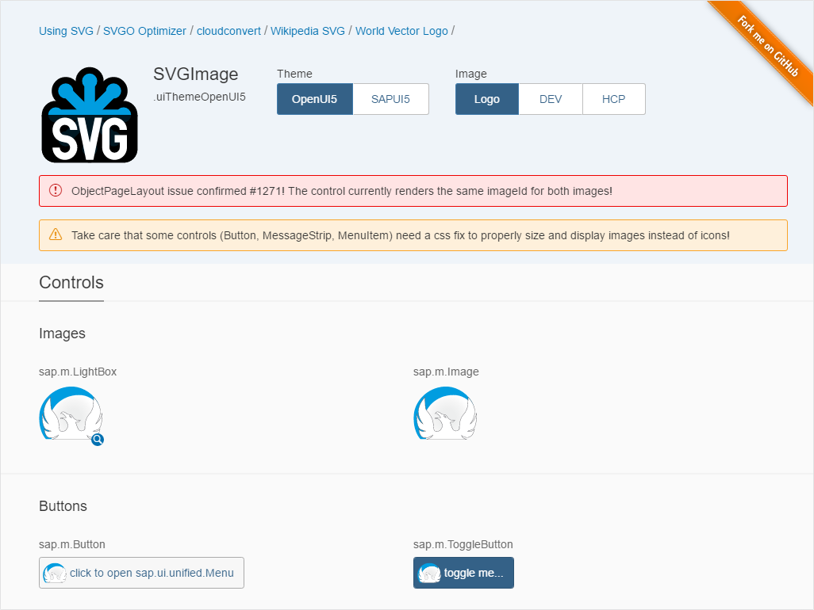

# ui5-control-svgimage
UI5 SVGImage control to embed svg image

# SVGImage

_UI5 svg image control_

SVGImage embedds referenced svg files by replacing DOM image with embedded SVG object.

See (https://github.com/hschaefer123/ui5-control-svgimage) for complete docs and demos.

## Demo


Launch Demo (https://svgimage-p1940953245trial.dispatcher.hanatrial.ondemand.com/demo/index.html)


## Initialize

With UI5

``` js
new ui5.control.SVGImage({
	src : "{svg/OpenUI5.inline.svg}"
});
```

With XMLView

Add a `data-masonry` attribute to your element. Options can be set in JSON in the value.

``` html
xmlns:uc="ui5.control"
...
<uc:SVGImage src="svg/OpenUI5.inline.svg" />
```

## License

SVGImage is released under the [MIT license](http://desandro.mit-license.org). Have at it.